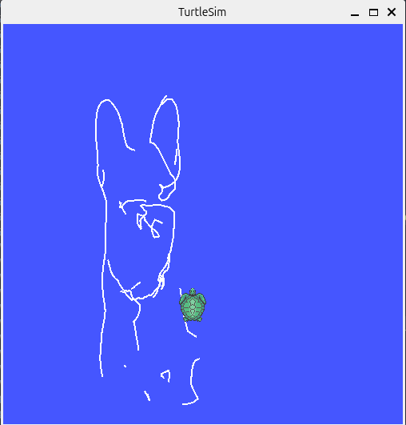
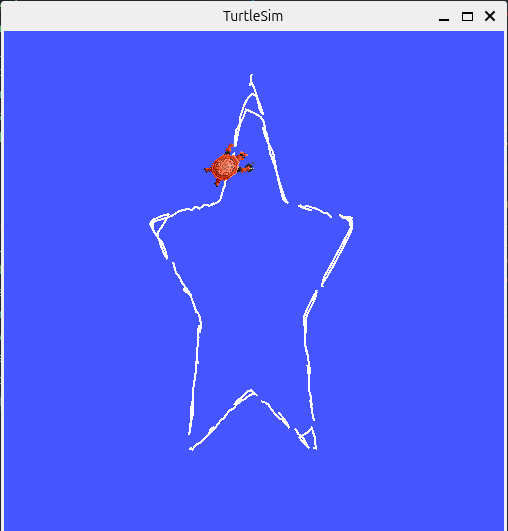

# Turtle Draw — Visão Computacional com ROS 2

Pipeline completa de visão computacional implementada do zero (NumPy puro) que extrai contornos de uma imagem e comanda a tartaruga do Turtlesim para desenhá-los.

## Estrutura

```
Visao-computacional-Ros/
├── pipeline_visao/              ← pipeline de visão (NumPy + cv2 só para carregar)
│   ├── __init__.py
│   ├── processamento.py         # escala de cinza + blur gaussiano
│   ├── detector_bordas.py       # operador de Sobel + binarização
│   └── mapeamento.py            # mapeamento de pixels → coordenadas Turtlesim
├── turtle_draw_ws/
│   └── src/
│       └── turtle_commander/    ← pacote ROS 2
│           ├── package.xml
│           ├── setup.py
│           ├── resource/
│           │   └── turtle_commander
│           ├── scripts/
│           │   └── drawer_node  # entry-point ros2 run
│           └── turtle_commander/
│               ├── __init__.py
│               └── drawer_node.py
├── testar_pipeline.py           ← visualização das etapas via matplotlib
├── imagens/
│   ├── dog.jpg                  ← cachorro (1280×720 px)
│   └── star.png                 ← estrela (imagem padrão, usada sem IMAGEM_ENTRADA)
└── README.md
```

## Dependências

- Python 3.10+
- NumPy
- OpenCV (`cv2`) — apenas para carregar a imagem
- Matplotlib — apenas para visualização da pipeline
- ROS 2 Jazzy
- pacote `turtlesim`

```bash
pip install numpy opencv-python matplotlib
```

## Como executar

### 1. Compilar o pacote ROS 2

```bash
cd turtle_draw_ws
source /opt/ros/jazzy/setup.bash
colcon build --packages-select turtle_commander
source install/setup.bash
```

### 2. Iniciar o Turtlesim (Terminal 1)

```bash
source /opt/ros/jazzy/setup.bash
ros2 run turtlesim turtlesim_node
```

### 3. Executar o nó desenhador (Terminal 2)

```bash
cd turtle_draw_ws
source /opt/ros/jazzy/setup.bash && source install/setup.bash
ros2 run turtle_commander drawer_node
```

Para escolher a imagem via variável de ambiente:

```bash
# cachorro
IMAGEM_ENTRADA=/home/frequis/ros/Visao-computacional-Ros/imagens/dog.jpg ros2 run turtle_commander drawer_node

# estrela (padrão)
IMAGEM_ENTRADA=/home/frequis/ros/Visao-computacional-Ros/imagens/star.png ros2 run turtle_commander drawer_node
```

### 4. Visualizar a pipeline isoladamente (sem ROS)

O script `testar_pipeline.py` executa todas as etapas e abre uma janela matplotlib com os resultados de cada transformação.

```bash
cd Visao-computacional-Ros

python3 testar_pipeline.py imagens/star.png
python3 testar_pipeline.py imagens/dog.jpg
```

São exibidos 6 painéis: imagem original, escala de cinza, blur gaussiano, bordas Sobel, binarização e o caminho final ordenado no espaço do Turtlesim.

> **Dependência extra:** `matplotlib` (`pip install matplotlib`)

## Resultados dos Testes

### dog.jpg — 1280 × 720 px



### star.png — 736 × 386 px

